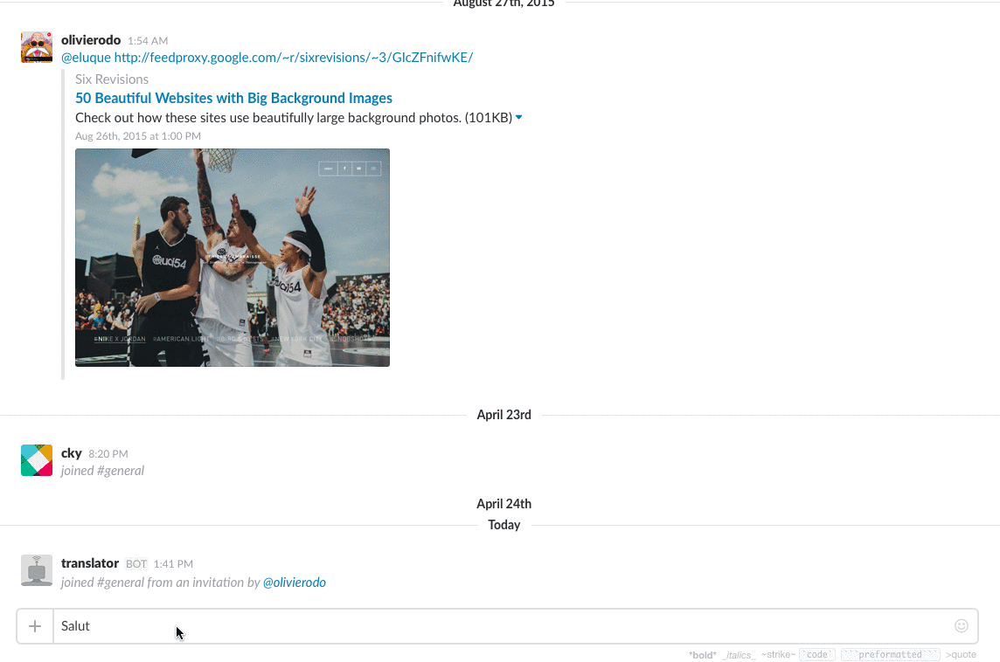

[](https://travis-ci.org/olivierodo/translator-slack-bot)

# Bolibot

*Bolibot* is the best [slack](https://slack.com/) bot international team friend

# Setup

### Official Version

You can add *Bolibot* to your slack team visit : http://bolibot.bolinbo.io

# Features

|  |  | Type  |
| ----------------------------------------------------- | ------------------- | ------------------------ |
| Send a translated message on public channel/group     | :heavy_check_mark:  | Slash Command `/{lang}` |
| Send a translated message on private channel/group    | :heavy_check_mark:  | Slash Command `/{lang}` |
| Send a translated message on private chat             | :heavy_check_mark:  | Slash Command `/{lang}` |
| Translate a received message on public channel/group  | :heavy_check_mark:  | Add a flag's reaction on the message you want to translate |
| Translate a received message on private channel/group | :heavy_check_mark:  | Add a flag's reaction on the message you want to translate |
| Translate a received message on private chat          | :x:                 | The bot have to give you some privacy, private chat are PRIVATE |

### Slash command

The Slash command allows you to send a translated message.

* `/fr Hello` will translate hello in french then your recipient will see a message from you says :`bonjour`

> Preview

The slash commandes available are :

| Slash Command              | Language |
| -------------------- | -------- |
| `/en [YOUR MESSAGE]` | English  |
| `/fr [YOUR MESSAGE]` | French   |
| `/de [YOUR MESSAGE]` | Deutch   |
| `/es [YOUR MESSAGE]` | Spanish  |
| `/kr [YOUR MESSAGE]` | Korean   |
| `/cn [YOUR MESSAGE]` | Chinese  |
| `/th [YOUR MESSAGE]` | Thai     |
| `/it [YOUR MESSAGE]` | Italian  |
| `/jp [YOUR MESSAGE]` | Japanese |


### Reactions

*Bolibot* use the flag's emoji to translate archived or just received message.
You just have to add a flag emoji as a reaction to the message you want to translate.

> 

The flag's reactions are :

| Language | Reaction |
| ----     | ---- |
| English | :gb: `:flag-gb:` <br> :us: `:flag-us:` <br> :us: `:flag-um:` |
| French | :fr: `:flag-fr:` |
| Deutch | :de: `:flag-de:` |
| Spanish | :es: `:flag-ea:` <br> :es: `:flag-ea:` |
| Korean | :kr: `:flag-kr:`|
| Chinese | :cn: `:flag-cn:`|
| Thai | 🇹🇭  `:flag-th:`|
| Japanese | :jp:  `:flag-jp:`|
| Italian | :it:  `:flag-it:`|

# Deploy your own Bolibot

The app is designed to run easily on Heroku or Docker.

To host and install *Bolibot* you have to :
* Create a google translate api key
* Create a slack token

If you wants to add a new language edit [default.json](/config/defaulg.json)


## Heroku

[](https://heroku.com/deploy?template=https://github.com/olivierodo/translator-slack-bot)

## Docker

https://hub.docker.com/r/olivierodo/translate-slack-bot/

### Getting started

Get the Docker container
```
docker pull olivierodo/translate-slack-bot
```

Use Custom App integration

```
docker run -p 80:5000 \
 -e SLACK_TOKEN=XXXX \
 olivierodo/translate-slack-bot
```

Use the Offical App integration

```
docker run -p 80:5000 \
 -e CLIENT_ID=XXXX \
 -e CLIENT_SECRET=XXXX \
 -e FIREBASE_URL=XXXX \
 olivierodo/translate-slack-bot
```

# What If ?

## I need to translate on a language not available.

Please [create a issue](https://github.com/olivierodo/bolibot/issues/new) or send an email to the support team : support@bolingo.io

## I had a reaction to a message but the bot doesn't answer.

The bot is a team memer as everyone else so the bot can only post on channel/group that he is invited.
The same for the private tchat the bot is not able to acces to you private conversation if you don't invite him.

# Contributors

* [Olivier Rodomond](https://github.com/olivierodo)

[How to contribute ?](doc/contributing.md)
